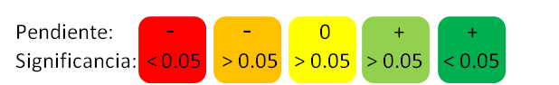

---
title: `r params$title`
---

```{r setup, include=FALSE}
knitr::opts_chunk$set(echo = F, fig.height = 3, warning = F, message = F, results = 'asis')
```

```{r cargar paquetes}

suppressPackageStartupMessages({
  library(ggplot2)
  library(dplyr)
  library(tidyr)
  library(MPAtools)
  library(reshape)
  library(stargazer)
  library(ggExtra)
})

```

<style type="text/css">
.table {

width: 80%;

}
</style>

*Este documento fue generado por el paquete [`MPAtools`](https://github.com/turfeffect/MPAtools), uno de los entregables del grupo [TURFeffect](www.turfeffect.org). Los resultados presentados son una version preliminar del software que se esta desarrollando, y no recomendamos la toma de decisiones basado en la informacion aqui presentada*

*Acentos y caracteres especiales omitidos*

# Resumen

<center>

**Leyenda**

----



----

</center>

```{r}

results <- params$results
  
```


```{r, results = 'asis'}
results %>%
  filter(!is.na(color)) %>% 
  mutate(Puntaje = paste0("")) %>%
  select(Indicador = Ind,
         Puntaje) %>%
  knitr::kable()
```


<center>

# Ecologicos

## Peces

### Densidad

```{r densidad peces, fig.cap = "Densidad promedio de peces (org / m^2).", eval = F}

Np <- density(data = peces, location = comunidad)

mpa_plot3(Np, reserve = reserva, control = control, y.lab = "Densidad (org / m^2)")

```

```{r tabla densidad peces, results = 'asis', eval = F}

stargazer(turfeffect(Np, reserve = reserva, control = control), dep.var.labels = "Densidad (org / transecto)", type = "html", dep.var.caption = "", report = "vc*", single.row = T, omit.stat = c("adj.rsq", "n"), digits = 2, df = F, notes = "+p < 0.1, ++p<0.05, +++p<0.001", notes.append = FALSE, star.char = "+")

```

# Socioeconomicos

## Arribos

### Arribos de langosta

```{r, eval = F}

ggplot(socioeco, aes(x = Year, y = Landings)) +
  geom_point(color = "red") +
  geom_line() +
  theme_bw()

```

```{r, eval = F}

stargazer(lm(Landings~Year, socioeco), dep.var.labels = "Densidad (org / transecto)", type = "html", dep.var.caption = "", report = "vc*", single.row = T, omit.stat = c("adj.rsq", "n"), digits = 2, df = F, notes = "+p < 0.1, ++p<0.05, +++p<0.001", notes.append = FALSE, star.char = "+")

```

