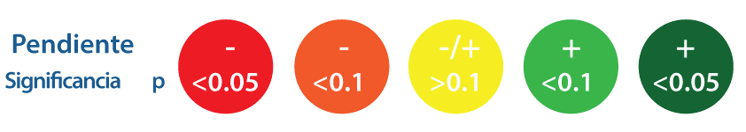

---
title: `r paste("Reporte para", params$rc, "en", params$comunidad)`
---

```{r setup, include=FALSE}

knitr::opts_chunk$set(echo = F, fig.height = 3, warning = F, message = F, results = 'asis')

```

```{r cargar paquetes}

suppressPackageStartupMessages({
  library(gridExtra)
  library(MPAtools)
  library(stargazer)
  library(shiny)
  library(scales)
  library(tidyverse)
})

```

\clearpage

# Acerca del reporte

*Acentos y caracteres especiales omitidos*

Este reporte tecnico fue producido por [MAREA](www.turfeffect.org/apps), una aplicacion desarrollada por el grupo [TURFeffect](www.turfeffect.org) para evaluar la efectividad de reservas marinas en Mexico. A continuacion, te proporcionamos una breve descripcion de lo que encontraras en el reporte, junto con indicaciones de como leer e interpretar lsa graficas y tablas generadas.

**Resumen y leyenda**

Lo primero que veras en el reporte es un resumen, similar al que se produjo como "scorecard" dentro de MAREA. A cada indicador se le asocia un color. Los colores posibles son rojo, naranja, amarillo, verde y olivo. Junto con el resumen, te proporcionamos una leyenda con la que puedes interpretar estos colores. Los colores se definen utilizando el signo o sentido (positivo o negativo) del termino de efectividad (descrito a cotninuacion) y su significancia estadistica. Si tienes dudas, consulta nuestra [Guia para la evaluacion de zonas de no pesca en Mexico](http://www.turfeffect.org/our-project.)

**Modelos utilizados**

Para estimar la efectividad de la reserva en los indicadores numericos utilizamos modelos de regresion lineal multiple. Los coeficientes se estiman por medio de minimos cuadrados ordinarios y errores estandar robustos a muestras heterocedasticas.

Para los indicadores biofisicos el modelo es:

$$I_{i,t} = \beta_0 + \Sigma_{t = 2}^{T} \gamma_{i,t} Ano_t + \beta_2 Zona_i + \beta_3 Zona_i \times Post_{i,t} + \omega_{i,t}+\epsilon_{i,t}$$

 En el caso de los indicadores socioeconomicos, que no cuentan con un control de referencia, el modelo toma la forma:

$$I_{i,t} = \beta_0 + \beta_3 Zona_i \times Post_{i,t} + \epsilon_{i,t}$$
Donde $\omega$ representa a las covariables como:

$$\omega_{i,t} = \beta_4T_{i,t} + \beta_5V_{i,t} + \beta_6P_{i,t}$$

Donde:

  $i$ y $t$ son subindices indicando transecto y ano, respectivamente

  $I$ es el valor del indicador

  $Ano$ es una variable dummy para los anos, codificando el primer ano como el nivel de referencia

  $Zona$ es una variable dummy indicando el tratamiento (*i.e.* control o reserva) utilizando control como el nivel de referencia

  $Post$ es una variable dummy para pre / post la implementacion de la reserva, utilizando antes como el nivel de referencia

  $T$ es la temperatura del agua ($C$) observada durante el transecto

  $V$ es la visibilidad horizontal (m) en el transecto

  $P$ es la profundidad (m) a la que se realizo el transecto, y

  $\epsilon$ es el error asociado a la regresion

En ocasiones los buzos monitores olvidan registrar una o varias de las covariables (Temperatura, Visibilidad o Profundidad) durante el buceo. Esto se traduciria en eliminar el transecto entero del analisis y perder informacion valiosa. Sin embargo, MAREA ayuda a evitar esto eliminando covariables en lugar de observaciones. Por default, las tres covariables son incluidas. Si el incluir una de ellas representa perder mas del 10% de las muestras, MAREA la descarta. Por lo tanto, es posible que algunas tablas de regresion tengan informacion para diferentes covariables.

Para los indicadores descriptivos, proveemos una sintesis de las encuestas realizadas junto con mensajes basados en una revision literaria.

**Pares Figura - Tabla**

Para cada uno de los indicadores numericos generamos una grafica y una tabla. Las figuras presentan series de tiempo de cada indicador. Los puntos son ajustados verticalmente para mejorar la visualizacion, pero se debe de entender que los muestreos se realizan de manera anual. Cada punto representa un transecto. Las lineas negras representan el promedio anual por tratamiento (reserva / control), y las bandas de colores indican $\pm$ 1 error estandar con respecto de la media. La informacion de la reserva aparecera en rojo, y la de la(s) zona(s) control en azul. En cuanto a las tablas, presentamos las estimaciones de todos los coeficientes de las variables utilizadas en la regresion lineal. El termino **Efecto** representa el efecto que ha tenido la reserva en cada indicador.

**Observas algo raro?**

Si notas alguna inconsistencia en el reporte, o tienes problemas con MAREA, reporta tu problema a contact@turfeffect.org. Sera util si proporcioans tus datos asi como capturas de pantalla y los objetivos / indicadores seleccionados. Esto nos permitira replicar los posibles problemas y rastrear su causa para poder solucionarlos.
  
\clearpage

# Resumen

<center>



</center>

```{r}
if(is.null(params$results_bio)){
  results_bio <- tibble::tibble(
    Ind = seq(1, 29),
    e = NA,
    p = NA,
    string = NA,
    color = NA,
    model = list(NA),
    plot = list(NA)
  )
} else {results_bio <- params$results_bio}

if(is.null(params$results_bio_i)){
  results_bio_i <- tibble::tibble(
    Ind = seq(1, 11),
    e = NA,
    p = NA,
    string = NA,
    color = NA,
    model = list(NA),
    plot = list(NA)
  )
} else {results_bio_i <- params$results_bio_i}

if(is.null(params$results_soc)){
  results_soc <- tibble::tibble(
    Ind = seq(1, 18),
    e = NA,
    p = NA,
    string = NA,
    color = NA,
    model = list(NA),
    plot = list(NA)
  )
} else {results_soc <- params$results_soc}

if(is.null(params$results_gov$results)){
  results_gov <- tibble::tibble(
    Ind = seq(1,13),
    e = NA,
    p = NA,
    string = NA,
    color = NA,
    model = list(NA),
    plot = list(NA)
  )
} else {results_gov <- params$results_gov$results}

if(is.null(params$results_gov$data)){
  gov <- NULL
} else {
  gov <- params$results_gov$data %>%
    filter(Community == params$comunidad, Q2_Name %in% c(params$reserva, NA))
}
```

```{r}
summary_table(results_bio, results_bio_i, results_soc, results_gov) %>% 
  knitr::kable(align = "r")
```

\clearpage

<!-- # Ecologicos -->

```{r}
if(!is.null(params$results_bio)|!is.null(params$results_bio_i)){cat("# Ecologicos\n")}
```

<!-- ## Peces -->

```{r}
if(!is.null(params$results_bio)){cat("## Peces\n")}
```

<!-- ### Shannon -->

```{r, fig.cap="Indice de diversidad de Shannon"}
if(!is.na(results_bio$plot[[1]])) {cat("### Indice de diversidad de Shannon\n")
  results_bio$plot[[1]]}
```

```{r, results = 'asis'}
if(!is.na(results_bio$model[[1]])){reg_table(model = results_bio$model[[1]],
                                             title = "Tabla de regresion para el indice de diversidad de Shannon",
                                             dep.var.labels = "Shannon (H'/transecto)")}
```

```{r}
if(!is.na(results_bio$plot[[1]])) {cat("\\clearpage")}
```

<!-- ### Riqueza -->

```{r, fig.cap = "Riqueza especifica"}
if(!is.na(results_bio$plot[[2]])) {cat("### Riqueza\n")
  results_bio$plot[[2]]}
```

```{r, results = 'asis'}
if(!is.na(results_bio$model[[2]])) {reg_table(model = results_bio$model[[2]],
                                              title = "Tabla de regresion para riqueza especifica",
                                              dep.var.labels = "Riqueza (Spp/transecto)")}
```

```{r}
if(!is.na(results_bio$plot[[2]])) {cat("\\clearpage")}
```

<!-- ### Organismos Maduros -->

```{r, fig.cap = "Densidad de organismos maduros"}
if(!is.na(results_bio$plot[[3]])) {cat("### Organismos maduros 1\n")
  results_bio$plot[[3]]}
```

```{r, results = 'asis'}
if(!is.na(results_bio$model[[3]])) {reg_table(results_bio$model[[3]],
                                              title = "Tabla de regresion para densidad de organismos maduros",
                                              dep.var.labels = "Organismos > Lm")}
```

```{r}
if(!is.na(results_bio$plot[[3]])) {cat("\\clearpage")}
```

<!-- Organismos maduros 2 -->

```{r, fig.cap = "Densidad de organismos maduros"}
if(!is.na(results_bio$plot[[9]])) {cat("### Organismos maduros 2\n")
  results_bio$plot[[9]]}
```

```{r, results = 'asis'}
if(!is.na(results_bio$model[[9]])) {reg_table(results_bio$model[[9]],
                                              title = "Tabla de regresion para densidad de organismos maduros",
                                              dep.var.labels = "Organismos > Lm")}
```

```{r}
if(!is.na(results_bio$plot[[9]])) {cat("\\clearpage")}
```

<!-- Organismos maduros 3 -->

```{r, fig.cap = "Densidad de organismos maduros"}
if(!is.na(results_bio$plot[[10]])) {cat("### Organismos maduros 3\n")
  results_bio$plot[[10]]}
```

```{r, results = 'asis'}
if(!is.na(results_bio$model[[10]])) {reg_table(results_bio$model[[10]],
                                              title = "Tabla de regresion para densidad de organismos maduros",
                                              dep.var.labels = "Organismos > Lm")}
```

```{r}
if(!is.na(results_bio$plot[[10]])) {cat("\\clearpage")}
```

<!-- Organismos maduros 4 -->

```{r, fig.cap = "Densidad de organismos maduros"}
if(!is.na(results_bio$plot[[11]])) {cat("### Organismos maduros 4\n")
  results_bio$plot[[11]]}
```

```{r, results = 'asis'}
if(!is.na(results_bio$model[[11]])) {reg_table(results_bio$model[[11]],
                                              title = "Tabla de regresion para densidad de organismos maduros",
                                              dep.var.labels = "Organismos > Lm")}
```

```{r}
if(!is.na(results_bio$plot[[11]])) {cat("\\clearpage")}
```

<!-- Organismos maduros 5 -->

```{r, fig.cap = "Densidad de organismos maduros"}
if(!is.na(results_bio$plot[[12]])) {cat("### Organismos maduros 5\n")
  results_bio$plot[[12]]}
```

```{r, results = 'asis'}
if(!is.na(results_bio$model[[12]])) {reg_table(results_bio$model[[12]],
                                              title = "Tabla de regresion para densidad de organismos maduros",
                                              dep.var.labels = "Organismos > Lm")}
```

```{r}
if(!is.na(results_bio$plot[[12]])) {cat("\\clearpage")}
```

<!-- Organismos maduros 6 -->

```{r, fig.cap = "Densidad de organismos maduros"}
if(!is.na(results_bio$plot[[13]])) {cat("### Organismos maduros 6\n")
  results_bio$plot[[13]]}
```

```{r, results = 'asis'}
if(!is.na(results_bio$model[[13]])) {reg_table(results_bio$model[[13]],
                                              title = "Tabla de regresion para densidad de organismos maduros",
                                              dep.var.labels = "Organismos > Lm")}
```

```{r}
if(!is.na(results_bio$plot[[13]])) {cat("\\clearpage")}
```

<!-- Organismos maduros 7 -->

```{r, fig.cap = "Densidad de organismos maduros"}
if(!is.na(results_bio$plot[[14]])) {cat("### Organismos maduros 7\n")
  results_bio$plot[[14]]}
```

```{r, results = 'asis'}
if(!is.na(results_bio$model[[14]])) {reg_table(results_bio$model[[14]],
                                              title = "Tabla de regresion para densidad de organismos maduros",
                                              dep.var.labels = "Organismos > Lm")}
```

```{r}
if(!is.na(results_bio$plot[[14]])) {cat("\\clearpage")}
```

<!-- Organismos maduros 8 -->

```{r, fig.cap = "Densidad de organismos maduros"}
if(!is.na(results_bio$plot[[15]])) {cat("### Organismos maduros 8\n")
  results_bio$plot[[15]]}
```

```{r, results = 'asis'}
if(!is.na(results_bio$model[[15]])) {reg_table(results_bio$model[[15]],
                                              title = "Tabla de regresion para densidad de organismos maduros",
                                              dep.var.labels = "Organismos > Lm")}
```

```{r}
if(!is.na(results_bio$plot[[15]])) {cat("\\clearpage")}
```

<!-- ### Densidad Organismos -->

```{r, fig.cap = "Densidad de organismos"}
if(!is.na(results_bio$plot[[4]])) {cat("### Densidad\n")
  results_bio$plot[[4]]}
```

```{r, results = 'asis'}
if(!is.na(results_bio$model[[4]])) {reg_table(results_bio$model[[4]],
                                              title = "Tabla de regresion para densidad de organismos",
                                              dep.var.labels = "Densidad (Organismos/transecto)")}
```

```{r}
if(!is.na(results_bio$plot[[4]])) {cat("\\clearpage")}
```

<!-- ### Densidad objetivo 1 -->

```{r, fig.cap = "Densidad de especies objetivo"}
if(!is.na(results_bio$plot[[5]])) {cat("### Densidad de especies objetivo 1\n")
  results_bio$plot[[5]]}

```

```{r, results = 'asis'}
if(!is.na(results_bio$model[[5]])) {reg_table(results_bio$model[[5]],
                                              title = "Tabla de regresion para densidad de especies objetivo",
                                              dep.var.labels = "Densidad (Organismos/transecto)")}
```

```{r}
if(!is.na(results_bio$plot[[5]])) {cat("\\clearpage")}
```

<!-- ### Densidad objetivo 2 -->

```{r, fig.cap = "Densidad de especies objetivo"}
if(!is.na(results_bio$plot[[23]])) {cat("### Densidad de especies objetivo 2\n")
  results_bio$plot[[23]]}

```

```{r, results = 'asis'}
if(!is.na(results_bio$model[[23]])) {reg_table(results_bio$model[[23]],
                                              title = "Tabla de regresion para densidad de especies objetivo",
                                              dep.var.labels = "Densidad (Organismos/transecto)")}
```

```{r}
if(!is.na(results_bio$plot[[23]])) {cat("\\clearpage")}
```

<!-- ### Densidad objetivo 3 -->

```{r, fig.cap = "Densidad de especies objetivo"}
if(!is.na(results_bio$plot[[24]])) {cat("### Densidad de especies objetivo 3\n")
  results_bio$plot[[24]]}

```

```{r, results = 'asis'}
if(!is.na(results_bio$model[[24]])) {reg_table(results_bio$model[[24]],
                                              title = "Tabla de regresion para densidad de especies objetivo",
                                              dep.var.labels = "Densidad (Organismos/transecto)")}
```

```{r}
if(!is.na(results_bio$plot[[24]])) {cat("\\clearpage")}
```

<!-- ### Densidad objetivo 4 -->

```{r, fig.cap = "Densidad de especies objetivo"}
if(!is.na(results_bio$plot[[25]])) {cat("### Densidad de especies objetivo 4\n")
  results_bio$plot[[25]]}

```

```{r, results = 'asis'}
if(!is.na(results_bio$model[[25]])) {reg_table(results_bio$model[[25]],
                                              title = "Tabla de regresion para densidad de especies objetivo",
                                              dep.var.labels = "Densidad (Organismos/transecto)")}
```

```{r}
if(!is.na(results_bio$plot[[25]])) {cat("\\clearpage")}
```

<!-- ### Densidad objetivo 5 -->

```{r, fig.cap = "Densidad de especies objetivo"}
if(!is.na(results_bio$plot[[26]])) {cat("### Densidad de especies objetivo 5\n")
  results_bio$plot[[26]]}

```

```{r, results = 'asis'}
if(!is.na(results_bio$model[[26]])) {reg_table(results_bio$model[[26]],
                                              title = "Tabla de regresion para densidad de especies objetivo",
                                              dep.var.labels = "Densidad (Organismos/transecto)")}
```

```{r}
if(!is.na(results_bio$plot[[26]])) {cat("\\clearpage")}
```

<!-- ### Densidad objetivo 6 -->

```{r, fig.cap = "Densidad de especies objetivo"}
if(!is.na(results_bio$plot[[27]])) {cat("### Densidad de especies objetivo 6\n")
  results_bio$plot[[27]]}

```

```{r, results = 'asis'}
if(!is.na(results_bio$model[[27]])) {reg_table(results_bio$model[[27]],
                                              title = "Tabla de regresion para densidad de especies objetivo",
                                              dep.var.labels = "Densidad (Organismos/transecto)")}
```

```{r}
if(!is.na(results_bio$plot[[27]])) {cat("\\clearpage")}
```

<!-- ### Densidad objetivo 7 -->

```{r, fig.cap = "Densidad de especies objetivo"}
if(!is.na(results_bio$plot[[28]])) {cat("### Densidad de especies objetivo 7\n")
  results_bio$plot[[28]]}

```

```{r, results = 'asis'}
if(!is.na(results_bio$model[[28]])) {reg_table(results_bio$model[[28]],
                                              title = "Tabla de regresion para densidad de especies objetivo",
                                              dep.var.labels = "Densidad (Organismos/transecto)")}
```

```{r}
if(!is.na(results_bio$plot[[28]])) {cat("\\clearpage")}
```

<!-- ### Densidad objetivo 8 -->

```{r, fig.cap = "Densidad de especies objetivo"}
if(!is.na(results_bio$plot[[29]])) {cat("### Densidad de especies objetivo 8\n")
  results_bio$plot[[29]]}

```

```{r, results = 'asis'}
if(!is.na(results_bio$model[[29]])) {reg_table(results_bio$model[[29]],
                                              title = "Tabla de regresion para densidad de especies objetivo",
                                              dep.var.labels = "Densidad (Organismos/transecto)")}
```

```{r}
if(!is.na(results_bio$plot[[29]])) {cat("\\clearpage")}
```

<!-- ### Nivel trofico -->

```{r, fig.cap = "Nivel trofico medio"}
if(!is.na(results_bio$plot[[6]])){cat("### Nivel trofico\n")
  results_bio$plot[[6]]}
```

```{r, results = 'asis'}
if(!is.na(results_bio$model[[6]])) {reg_table(results_bio$model[[6]],
                                              title = "Tabla de regresion para nivel trofico medio",
                                              dep.var.labels = "Nivel trofico")}
```

```{r}
if(!is.na(results_bio$plot[[6]])) {cat("\\clearpage")}
```

<!-- ### Biomasa -->

```{r, fig.cap = "Biomasa"}
if (!is.na(results_bio$plot[[7]])) {cat("### Biomasa\n")
  results_bio$plot[[7]]}
```

```{r, results = 'asis'}
if(!is.na(results_bio$model[[7]])) {reg_table(results_bio$model[[7]],
                                              title = "Tabla de regresion para biomasa",
                                              dep.var.labels = "Biomasa (Kg/transecto)")}
```

```{r}
if(!is.na(results_bio$plot[[7]])) {cat("\\clearpage")}
```

<!-- ### Biomasa objetivo 1 -->

```{r, fig.cap = "Biomasa de especies objetivo"}
if (!is.na(results_bio$plot[[8]])) {cat("### Biomasa de especies objetivo 1\n")
  results_bio$plot[[8]]}
```

```{r, results = 'asis'}
if(!is.na(results_bio$model[[8]])) {reg_table(results_bio$model[[8]],
                                              title = "Tabla de regresion para biomasa de especies objetivo",
                                              dep.var.labels = "Biomasa (Kg/transecto)")}
```

```{r}
if(!is.na(results_bio$plot[[8]])) {cat("\\clearpage")}
```

<!-- ### Biomasa objetivo 2 -->

```{r, fig.cap = "Biomasa de especies objetivo"}
if (!is.na(results_bio$plot[[16]])) {cat("### Biomasa de especies objetivo 2\n")
  results_bio$plot[[16]]}
```

```{r, results = 'asis'}
if(!is.na(results_bio$model[[16]])) {reg_table(results_bio$model[[16]],
                                              title = "Tabla de regresion para biomasa de especies objetivo",
                                              dep.var.labels = "Biomasa (Kg/transecto)")}
```

```{r}
if(!is.na(results_bio$plot[[16]])) {cat("\\clearpage")}
```

<!-- ### Biomasa objetivo 3 -->

```{r, fig.cap = "Biomasa de especies objetivo"}
if (!is.na(results_bio$plot[[17]])) {cat("### Biomasa de especies objetivo 3\n")
  results_bio$plot[[17]]}
```

```{r, results = 'asis'}
if(!is.na(results_bio$model[[17]])) {reg_table(results_bio$model[[17]],
                                              title = "Tabla de regresion para biomasa de especies objetivo",
                                              dep.var.labels = "Biomasa (Kg/transecto)")}
```

```{r}
if(!is.na(results_bio$plot[[17]])) {cat("\\clearpage")}
```

<!-- ### Biomasa objetivo 4 -->

```{r, fig.cap = "Biomasa de especies objetivo"}
if (!is.na(results_bio$plot[[18]])) {cat("### Biomasa de especies objetivo 4\n")
  results_bio$plot[[18]]}
```

```{r, results = 'asis'}
if(!is.na(results_bio$model[[18]])) {reg_table(results_bio$model[[18]],
                                              title = "Tabla de regresion para biomasa de especies objetivo",
                                              dep.var.labels = "Biomasa (Kg/transecto)")}
```

```{r}
if(!is.na(results_bio$plot[[18]])) {cat("\\clearpage")}
```

<!-- ### Biomasa objetivo 5 -->

```{r, fig.cap = "Biomasa de especies objetivo"}
if (!is.na(results_bio$plot[[19]])) {cat("### Biomasa de especies objetivo 5\n")
  results_bio$plot[[19]]}
```

```{r, results = 'asis'}
if(!is.na(results_bio$model[[19]])) {reg_table(results_bio$model[[19]],
                                              title = "Tabla de regresion para biomasa de especies objetivo",
                                              dep.var.labels = "Biomasa (Kg/transecto)")}
```

```{r}
if(!is.na(results_bio$plot[[19]])) {cat("\\clearpage")}
```

<!-- ### Biomasa objetivo 6 -->

```{r, fig.cap = "Biomasa de especies objetivo"}
if (!is.na(results_bio$plot[[20]])) {cat("### Biomasa de especies objetivo 6\n")
  results_bio$plot[[20]]}
```

```{r, results = 'asis'}
if(!is.na(results_bio$model[[20]])) {reg_table(results_bio$model[[20]],
                                              title = "Tabla de regresion para biomasa de especies objetivo",
                                              dep.var.labels = "Biomasa (Kg/transecto)")}
```

```{r}
if(!is.na(results_bio$plot[[20]])) {cat("\\clearpage")}
```

<!-- ### Biomasa objetivo 7 -->

```{r, fig.cap = "Biomasa de especies objetivo"}
if (!is.na(results_bio$plot[[21]])) {cat("### Biomasa de especies objetivo 7\n")
  results_bio$plot[[21]]}
```

```{r, results = 'asis'}
if(!is.na(results_bio$model[[21]])) {reg_table(results_bio$model[[21]],
                                              title = "Tabla de regresion para biomasa de especies objetivo",
                                              dep.var.labels = "Biomasa (Kg/transecto)")}
```

```{r}
if(!is.na(results_bio$plot[[21]])) {cat("\\clearpage")}
```

<!-- ### Biomasa objetivo 8 -->

```{r, fig.cap = "Biomasa de especies objetivo"}
if (!is.na(results_bio$plot[[22]])) {cat("### Biomasa de especies objetivo 8\n")
  results_bio$plot[[22]]}
```

```{r, results = 'asis'}
if(!is.na(results_bio$model[[22]])) {reg_table(results_bio$model[[22]],
                                              title = "Tabla de regresion para biomasa de especies objetivo",
                                              dep.var.labels = "Biomasa (Kg/transecto)")}
```

```{r}
if(!is.na(results_bio$plot[[22]])) {cat("\\clearpage")}
```

<!-- ## Invertebrados -->

```{r}
if(!is.null(params$results_bio_i)){cat("## Invertebrados\n")}
```

<!-- ### Shannon -->

```{r}
if(!is.na(results_bio_i$plot[[1]])) {cat("### Indice de diversidad de Shannon\n")
  results_bio_i$plot[[1]]}
```

```{r, results = 'asis'}
if(!is.na(results_bio_i$model[[1]])){reg_table(results_bio_i$model[[1]],
                                               title = "Tabla de regresion para indice de diversidad de Shannon",
                                               dep.var.labels = "Shannon (H'/transecto)")}
```

```{r}
if(!is.na(results_bio_i$plot[[1]])) {cat("\\clearpage")}
```

<!-- ### Riqueza -->

```{r}
if(!is.na(results_bio_i$plot[[2]])) {cat("### Riqueza\n")
  results_bio_i$plot[[2]]}
```

```{r, results = 'asis'}
if(!is.na(results_bio_i$model[[2]])) {reg_table(results_bio_i$model[[2]],
                                               title = "Tabla de regresion para riqueza especifica",
                                               dep.var.labels = "Riqueza (Spp/transecto)")}
```

```{r}
if(!is.na(results_bio_i$plot[[2]])) {cat("\\clearpage")}
```

<!-- ### Densidad -->

```{r}
if(!is.na(results_bio_i$plot[[3]])) {cat("### Densidad\n")
  results_bio_i$plot[[3]]}
```

```{r, results = 'asis'}
if(!is.na(results_bio_i$model[[3]])) {reg_table(results_bio_i$model[[3]],
                                               title = "Tabla de regresion para densidad de organismos",
                                               dep.var.labels = "Densidad (Organismos/transecto)")}
```

```{r}
if(!is.na(results_bio_i$plot[[3]])) {cat("\\clearpage")}
```

<!-- ### Densidad objetivo 1 -->

```{r}
if(!is.na(results_bio_i$plot[[4]])) {cat("### Densidad de especies objetivo 1\n")
  results_bio_i$plot[[4]]}
```

```{r, results = 'asis'}
if(!is.na(results_bio_i$model[[4]])) {reg_table(results_bio_i$model[[4]],
                                               title = "Tabla de regresion para densidad de organismos",
                                               dep.var.labels = "Densidad (Organismos/transecto)")}
```

```{r}
if(!is.na(results_bio_i$plot[[4]])) {cat("\\clearpage")}
```

<!-- ### Densidad objetivo 2 -->

```{r}
if(!is.na(results_bio_i$plot[[5]])) {cat("### Densidad de especies objetivo 2\n")
  results_bio_i$plot[[5]]}
```

```{r, results = 'asis'}
if(!is.na(results_bio_i$model[[5]])) {reg_table(results_bio_i$model[[5]],
                                               title = "Tabla de regresion para densidad de organismos",
                                               dep.var.labels = "Densidad (Organismos/transecto)")}
```

```{r}
if(!is.na(results_bio_i$plot[[5]])) {cat("\\clearpage")}
```

<!-- ### Densidad objetivo 3 -->

```{r}
if(!is.na(results_bio_i$plot[[6]])) {cat("### Densidad de especies objetivo 3\n")
  results_bio_i$plot[[6]]}
```

```{r, results = 'asis'}
if(!is.na(results_bio_i$model[[6]])) {reg_table(results_bio_i$model[[6]],
                                               title = "Tabla de regresion para densidad de organismos",
                                               dep.var.labels = "Densidad (Organismos/transecto)")}
```

```{r}
if(!is.na(results_bio_i$plot[[6]])) {cat("\\clearpage")}
```

<!-- ### Densidad objetivo 4 -->

```{r}
if(!is.na(results_bio_i$plot[[7]])) {cat("### Densidad de especies objetivo 4\n")
  results_bio_i$plot[[7]]}
```

```{r, results = 'asis'}
if(!is.na(results_bio_i$model[[7]])) {reg_table(results_bio_i$model[[7]],
                                               title = "Tabla de regresion para densidad de organismos",
                                               dep.var.labels = "Densidad (Organismos/transecto)")}
```

```{r}
if(!is.na(results_bio_i$plot[[7]])) {cat("\\clearpage")}
```

<!-- ### Densidad objetivo 5 -->

```{r}
if(!is.na(results_bio_i$plot[[8]])) {cat("### Densidad de especies objetivo 5\n")
  results_bio_i$plot[[8]]}
```

```{r, results = 'asis'}
if(!is.na(results_bio_i$model[[8]])) {reg_table(results_bio_i$model[[8]],
                                               title = "Tabla de regresion para densidad de organismos",
                                               dep.var.labels = "Densidad (Organismos/transecto)")}
```

```{r}
if(!is.na(results_bio_i$plot[[8]])) {cat("\\clearpage")}
```


<!-- ### Densidad objetivo 6 -->

```{r}
if(!is.na(results_bio_i$plot[[9]])) {cat("### Densidad de especies objetivo 2\n")
  results_bio_i$plot[[9]]}
```

```{r, results = 'asis'}
if(!is.na(results_bio_i$model[[9]])) {reg_table(results_bio_i$model[[9]],
                                               title = "Tabla de regresion para densidad de organismos",
                                               dep.var.labels = "Densidad (Organismos/transecto)")}
```

```{r}
if(!is.na(results_bio_i$plot[[9]])) {cat("\\clearpage")}
```

<!-- ### Densidad objetivo 7 -->

```{r}
if(!is.na(results_bio_i$plot[[10]])) {cat("### Densidad de especies objetivo 7\n")
  results_bio_i$plot[[10]]}
```

```{r, results = 'asis'}
if(!is.na(results_bio_i$model[[10]])) {reg_table(results_bio_i$model[[10]],
                                               title = "Tabla de regresion para densidad de organismos",
                                               dep.var.labels = "Densidad (Organismos/transecto)")}
```

```{r}
if(!is.na(results_bio_i$plot[[10]])) {cat("\\clearpage")}
```

<!-- ### Densidad objetivo 8 -->

```{r}
if(!is.na(results_bio_i$plot[[11]])) {cat("### Densidad de especies objetivo 8\n")
  results_bio_i$plot[[11]]}
```

```{r, results = 'asis'}
if(!is.na(results_bio_i$model[[11]])) {reg_table(results_bio_i$model[[11]],
                                               title = "Tabla de regresion para densidad de organismos",
                                               dep.var.labels = "Densidad (Organismos/transecto)")}
```

```{r}
if(!is.na(results_bio_i$plot[[11]])) {cat("\\clearpage")}
```

<!-- Socioeconomicos  -->

```{r}
if(!is.null(params$results_soc)){cat("# Socioeconomicos\n")}
```

<!-- ## Arribos -->

```{r}
if(!is.na(results_soc$plot[[1]])) {
  cat("## Arribos\n")
  results_soc$plot[[1]]
}
```

```{r, results = 'asis'}
if(!is.na(results_soc$model[[1]])) {
  results_soc$model[[1]] %>%
    stargazer(
      dep.var.labels = "Arribos (Kg/ano)",
      header = F,
      type = "latex",
      dep.var.caption = "Indicador",
      report = "vcs*",
      omit.stat = "rsq",
      single.row = T,
      intercept.bottom = F, 
      star.cutoffs = c(0.1, 0.05, 0.001)
    )
}
```

<!-- ## Ingresos por arribos -->

```{r}
if(!is.na(results_soc$plot[[2]])) {
  cat("## Ingresos por arribos\n")
  results_soc$plot[[2]]
}
```

```{r, results = 'asis'}
if(!is.na(results_soc$model[[2]])) {
  results_soc$model[[2]] %>%
    stargazer(
      dep.var.labels = "Ingresos por arribos (pesos/ano)",
      header = F,
      type = "latex",
      dep.var.caption = "Indicador",
      report = "vcs*",
      omit.stat = "rsq",
      single.row = T,
      intercept.bottom = F, 
      star.cutoffs = c(0.1, 0.05, 0.001)
    )
}
```

<!-- Gobernanza -->

```{r}
if(!is.null(params$results_gov)){cat("\\clearpage")}
```

```{r, fig.height = 7.5, fig.width = 8}
if(!is.null(params$results_gov)){
  cat("# Gobernanza\n")
  cat("## Resumen demografico\n")
  cat(paste("El questionario de gobernanza se realizo en", dim(gov)[1], "miembros de la comunidad. Los demograficos basicos son:\n"))
  
  gender <- ggplot(gov, aes(x = Gender)) +
    geom_bar(aes(y = (..count..)/sum(..count..)), fill = "steelblue", color = "black") +
    theme_bw() +
    ggtitle(label = "Genero") +
    labs(x = "", y = "Proporcion") +
    scale_y_continuous(labels = percent)
  
  age <- ggplot(gov, aes(x = Age)) +
    geom_histogram(aes(y = (..count..)/sum(..count..)), fill = "steelblue", binwidth = 5, color = "black") +
    theme_bw() +
    ggtitle(label = "Edad") +
    labs(x = "", y = "Proporcion") +
    scale_y_continuous(labels = percent)
  
  occ <- ggplot(gov, aes(x = Occupation)) +
    geom_bar(aes(y = (..count..)/sum(..count..)), fill = "steelblue", color = "black") +
    theme_bw() +
    ggtitle(label = "Ocupacion") +
    labs(x = "", y = "Proporcion") +
    scale_y_continuous(labels = percent)
  
  TonC <- ggplot(gov, aes(x = TimeOnCommunity)) +
    geom_histogram(aes(y = (..count..)/sum(..count..)), fill = "steelblue", color = "black", binwidth = 5) +
    theme_bw() +
    ggtitle(label = "Tiempo en la comunidad") +
    labs(x = "", y = "Proporcion") +
    scale_y_continuous(labels = percent)
  
  education <- ggplot(gov, aes(x = Education)) +
    geom_bar(aes(y = (..count..)/sum(..count..)), fill = "steelblue", color = "black") +
    theme_bw() +
    ggtitle(label = "Nivel de educacion") +
    labs(x = "", y = "Proporcion") +
    scale_y_continuous(labels = percent)
  
  cobi_diver <- ggplot(gov, aes(x = Diver)) +
    geom_bar(aes(y = (..count..)/sum(..count..)), fill = "steelblue", color = "black") +
    theme_bw() +
    ggtitle(label = "Buzo de COBI") +
    labs(x = "", y = "Proporcion") +
    scale_y_continuous(labels = percent)
  
  grid.arrange(gender, age, occ, TonC, education, cobi_diver)
  
  cat("\\clearpage")
  }
```

<!-- Acceso a la pesqueria -->

```{r}
if(!is.na(results_gov$e[[1]])){
  cat("## Acceso a la pesqueria\n")
  cat(paste("El acceso a la pesqueria se maneja por medio de:", filter(gov, !is.na(Q7)) %>% {unique(.$Q7)}, ".\n"))
  cat(paste0("Mensaje: ",results_gov$string[[1]]))
  cat("\n")
}
```

<!-- Numero de pescadores -->

```{r}
if(!is.na(results_gov$e[[2]])){
  cat("## Numero de pescadores\n")
  cat(paste0("Mensaje: ",results_gov$string[[2]]))
  cat("\n")
  
  gov %>% 
    select(contains("Q10")) %>% 
    set_names(c("Antes", "Despues")) %>% 
    gather(Dim, Value) %>% 
    filter(!is.na(Value)) %>% 
    ggplot(aes(x = Dim, y = Value)) +
    geom_boxplot(fill = "steelblue") +
    stat_summary(geom = "point", fun.y = mean, color = "black", size = 10, pch = "*") +
    theme_bw() +
    labs(x = "") +
    ggtitle(label = "Numero de pescadores")
  
}
```

<!-- Reconocimiento legal de la reserva -->

```{r}
if(!is.na(results_gov$e[[3]])){
  cat("## Reconocimiento legal de la reserva\n")
  cat(paste0("Mensaje: ",results_gov$string[[3]], "\n"))
  cat("\n")
  
  gov %>% 
    select(Interviewee, contains("Q5")) %>% 
    set_names(c("Interviewee", "Reconocida", "En proceso", "Interesados")) %>% 
    gather(Dim, Value, -Interviewee) %>% 
    mutate(N = length(unique(Interviewee))) %>% 
    group_by(Dim, Value, N) %>% 
    count() %>%   
    mutate(n = n/N) %>% 
    ggplot(aes(x = Value, y = n)) +
    geom_col(fill = "steelblue", color = "black") +
    facet_grid(~Dim) +
    theme_bw() +
    ggtitle(label = "Reconocimiento legal de la reserva") +
    labs(x = "", y = "Proporcion") +
    scale_y_continuous(labels = percent)
}
```

<!-- Tipo de reserva -->

```{r}
if(!is.na(results_gov$e[[4]])){
  cat("## Tipo de reserva\n")
  cat(paste0("Mensaje: ",results_gov$string[[4]]))
  cat("\n")
  cat("\\clearpage")
}
```

<!-- Grado de pesca ilegal -->

```{r, fig.height = 10, fig.width = 8}
if(!is.na(results_gov$e[[5]])){
  cat("## Grado de pesca ilegal\n")
  cat(paste0("Mensaje: ",results_gov$string[[5]], "\n"))
  cat("\n")
  
  q13 <- ggplot(gov, aes(x = Q13)) +
    geom_bar(aes(y = (..count..)/sum(..count..)), fill = "steelblue", color = "black") +
    theme_bw() +
    ggtitle(label = "Vigilancia y procuracion percivida") +
    labs(x = "", y = "Proporcion") +
    scale_y_continuous(labels = percent)
  
  q14 <- gov %>% 
    select(contains("Q14")) %>% 
    set_names(c("De la comunidad en ZNP", "Foraneo en ZNP", "De la comunidad fuera de ZNP", "Foraneo fuera de ZNP")) %>% 
    gather(Dim, Value) %>% 
    ggplot(aes(x = Value)) +
    geom_bar(aes(y = (..count..)/sum(..count..)), fill = "steelblue", color = "black") +
    facet_grid(~Dim) +
    theme_bw() +
    ggtitle(label = "Pesca ilegal dentro y fuera de la reserva por miembros de la comunidad y foraneos") +
    coord_flip() +
    labs(x = "", y = "Proporcion") +
    scale_y_continuous(labels = percent)
  
  q19 <- gov %>% 
    select(contains("Q19")) %>% 
    set_names(c("Antes", "Despues")) %>% 
    gather(Dim, Value) %>% 
    ggplot(aes(x = Value)) +
    geom_bar(aes(y = (..count..)/sum(..count..)), fill = "steelblue", color = "black") +
    facet_grid(~Dim) +
    theme_bw() +
    ggtitle(label = "Pesca ilegal en la region") +
    labs(x = "", y = "Proporcion") +
    scale_y_continuous(labels = percent)
  
  q20 <- gov %>% 
    select(contains("Q20")) %>% 
    set_names(c("Yo pesco dentro de la ZNP", "Otros pescan dentro de la ZNP", "Foraneos pescan dentro de la ZNP")) %>% 
    gather(Dim, Value) %>% 
    ggplot(aes(x = Value)) +
    geom_bar(aes(y = (..count..)/sum(..count..)), fill = "steelblue", color = "black") +
    facet_grid(~Dim) +
    theme_bw() +
    ggtitle(label = "Percepcion de infractores") +
    labs(x = "", y = "Proporcion") +
    scale_y_continuous(labels = percent)
  
  grid.arrange(q13, q14, q19, q20, ncol = 1)
  
  cat("\\clearpage")
}
```

<!-- Plan de manejo -->

```{r}
if(!is.na(results_gov$e[[6]])){
  cat("## Plan de manejo\n")
  cat(paste0("Mensaje: ",results_gov$string[[6]], "\n"))
  cat("\n")
  
  gov %>% 
    select(Q6) %>% 
    gather(Dim, Value) %>% 
    ggplot(aes(x = Value)) +
    geom_bar(aes(y = (..count..)/sum(..count..)), fill = "steelblue", color = "black") +
    theme_bw() +
    ggtitle(label = "Existe un plan de manejo?") +
    labs(x = "", y = "Proporcion") +
    scale_y_continuous(labels = percent)
}
```

<!-- Procuracion y vigilancia de la reserva -->

```{r, fig.height = 7.5, fig.width = 8}
if(!is.na(results_gov$e[[1]])){
  cat("## Procuracion y vigilancia de la reserva\n")
  cat(paste0("Mensaje: ",results_gov$string[[7]],"\n"))
  cat("\n")
  cat(paste("Los principales actores para la procuracion y vigilancia son:", filter(gov, !is.na(Q4_3)) %>% {unique(.$Q4_3)}, ".\n"))
  cat("\n")
  cat(paste("La vigilancia se hace por medio de:", filter(gov, !is.na(Q8)) %>% {unique(.$Q8)}, ".\n"))
  cat("\n")
  
  q15 <- gov %>% 
    ggplot(aes(x = Q15)) +
    geom_bar(aes(y = (..count..)/sum(..count..)), fill = "steelblue", color = "black") +
    theme_bw() +
    ggtitle(label = "Percepcion de la procuracion por el gobierno") +
    labs(x = "", y = "Proporcion") +
    scale_y_continuous(labels = percent)
  
  q16 <- gov %>% 
    ggplot(aes(x = Q16)) +
    geom_bar(aes(y = (..count..)/sum(..count..)), fill = "steelblue", color = "black") +
    theme_bw() +
    labs(x = "") +
    ggtitle(label = "La procuracion funciona mejor cuando el gobierno esta involucrado") +
    labs(x = "", y = "Proporcion") +
    scale_y_continuous(labels = percent)
  
  q17 <- gov %>% 
    ggplot(aes(x = Q17)) +
    geom_bar(aes(y = (..count..)/sum(..count..)), fill = "steelblue", color = "black") +
    theme_bw() +
    ggtitle(label = "La procuracion funciona mejor cuando la comunidad esta involucrada") +
    labs(x = "", y = "Proporcion") +
    scale_y_continuous(labels = percent)
  
  grid.arrange(q15, q16, q17)
  
}
```

<!-- Tamano de la reserva -->

```{r}
if(!is.na(results_gov$e[[1]])){
  cat("## Tamano de la reserva\n")
  cat(paste0("Mensaje: ",results_gov$string[[8]], "\n"))
  
  cat("\\clearpage")
}
```

 <!-- Razonamiento para el diseno de la reserva -->

```{r}
if(!is.na(results_gov$e[[1]])){
  cat("## Razonamiento para el diseno de la reserva\n")

  gov$Q2_Reason <- "blah blah blah blah blah"
  
  gov %>% 
    mutate(Sujeto = 1:length(Interviewee)) %>% 
    select(Sujeto, Razon = Q2_Reason) %>% 
    knitr::kable()
}
```

<!-- Pertenencia y Tipo de organizacion pesquera -->

```{r}
if(!is.na(results_gov$e[[1]])){
  cat("## Pertenencia y Tipo de organizacion pesquera\n")
  cat(paste0("Mensaje: ",results_gov$string[[9]],"\n"))
  cat(paste("Los siguientes tipos de organizaciones pesqueras existen:", filter(gov, !is.na(Q1)) %>% {unique(.$Q1)},".\n"))
}
```

<!-- Representacion -->

```{r}
if(!is.na(results_gov$e[[1]])){
  cat("## Representacion\n")
  cat(paste("La creacion de las reservas fue **motivada** por:", filter(gov, !is.na(Q3)) %>% {unique(.$Q3)}, ".\n"))
  cat("\n")
  cat(paste("El **manejo** de las reservas se lleva a cabo por:", filter(gov, !is.na(Q4_1)) %>% {unique(.$Q4_1)}, "\n"))
  cat("\n")
  cat(paste("El **monitoreo** de las reservas se lleva a cabo por:", filter(gov, !is.na(Q4_2)) %>% {unique(.$Q4_2)}, ".\n"))
  cat("\n")
  cat(paste("Las **decisiones** se toman por:", filter(gov, !is.na(Q12)) %>% {unique(.$Q12)},".\n"))
  cat("\n")
  cat(paste("Tambien deberian de participar:", filter(gov, !is.na(Q12_1)) %>% {unique(.$Q12_1)}, "\n"))
}
```

<!-- Reglamentacion interna -->

```{r}
if(!is.na(results_gov$e[[10]])){
  cat("## Reglamentacion interna\n")
  cat(paste0("Mensaje: ",results_gov$string[[10]],"\n"))
  
  gov %>% 
    filter(!is.na(Q9)) %>% 
    ggplot(aes(x = Q9)) +
    geom_bar(aes(y = (..count..)/sum(..count..)), fill = "steelblue", color = "black") +
    theme_bw() +
    ggtitle(label = "Reglamentacion interna") +
    labs(x = "", y = "Proporcion") +
    scale_y_continuous(labels = percent)
}
```

<!-- Efectiviudad percibida  -->

```{r, fig.height = 10, fig.width = 8}
if(!is.na(results_gov$e[[11]])){
  cat("## Efectividad percibida\n")
  cat(paste0("Mensaje: ",results_gov$string[[11]],"\n"))
  cat("\n")
  
  q21_1 <- gov %>% 
    select(contains("Q21_1")) %>% 
    set_names(c("Riqueza", "Tallas", "Densidad", "Biomasa", "Abundancia de depredadores")) %>% 
    gather(Dim, Value) %>% 
    filter(!is.na(Value)) %>% 
    ggplot(aes(x = Value)) +
    geom_bar(aes(y = (..count..)/sum(..count..)), fill = "steelblue", color = "black") +
    facet_grid(~Dim) +
    theme_bw() +
    ggtitle(label = "Cambios biologicos") +
    coord_flip() +
    labs(x = "", y = "Proporcion") +
    scale_y_continuous(labels = percent)
  
  q21_2 <- gov %>% 
    select(contains("Q21_2")) %>% 
    set_names(c("Total landings", "Managed species landings", "Fisheries revenue", "Alternative economic activities")) %>% 
    gather(Dim, Value) %>% 
    filter(!is.na(Value)) %>% 
    ggplot(aes(x = Value)) +
    geom_bar(aes(y = (..count..)/sum(..count..)), fill = "steelblue", color = "black") +
    facet_grid(~Dim) +
    theme_bw() +
    ggtitle(label = "Socioeconomic changes") +
    labs(x = "", y = "Proporcion") +
    scale_y_continuous(labels = percent)
  
  q21_3 <- gov %>% 
    ggplot(aes(x = Q21_3)) +
    geom_bar(aes(y = (..count..)/sum(..count..)), fill = "steelblue", color = "black") +
    theme_bw() +
    ggtitle(label = "Local governance") +
    labs(x = "", y = "Proporcion") +
    scale_y_continuous(labels = percent)
  
  q22 <- gov %>% 
    ggplot(aes(x = Q22)) +
    geom_bar(aes(y = (..count..)/sum(..count..)), fill = "steelblue", color = "black") +
    theme_bw() +
    ggtitle(label = "Impacto general") +
    labs(x = "", y = "Proporcion") +
    scale_y_continuous(labels = percent)
  
  q23 <- gov %>% 
    ggplot(aes(x = Q23)) +
    geom_bar(aes(y = (..count..)/sum(..count..)), fill = "steelblue", color = "black") +
    theme_bw() +
    ggtitle(label = "Percepcion de efectividad") +
    labs(x = "", y = "Proporcion") +
    scale_y_continuous(labels = percent)
  
  grid.arrange(q21_1, q21_2, q21_3, q22, q23, ncol = 1)
}
```


