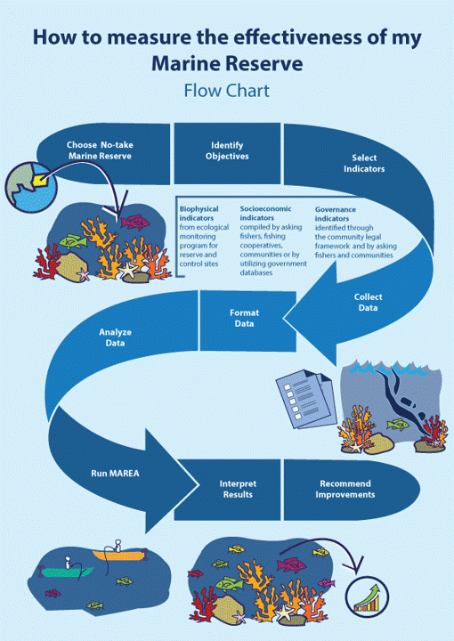
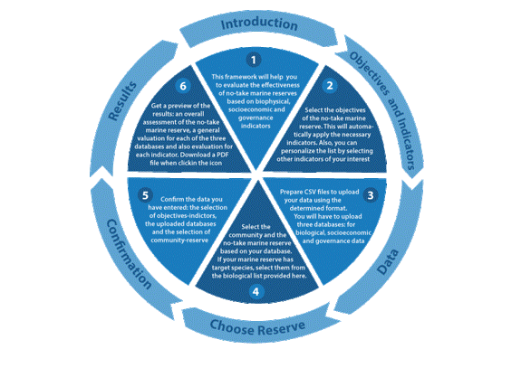
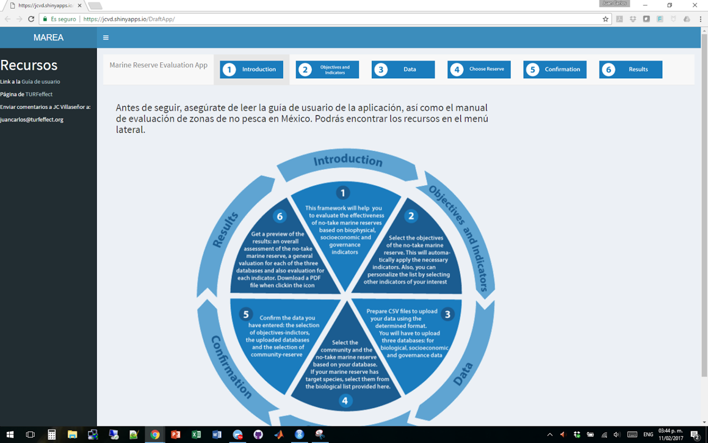
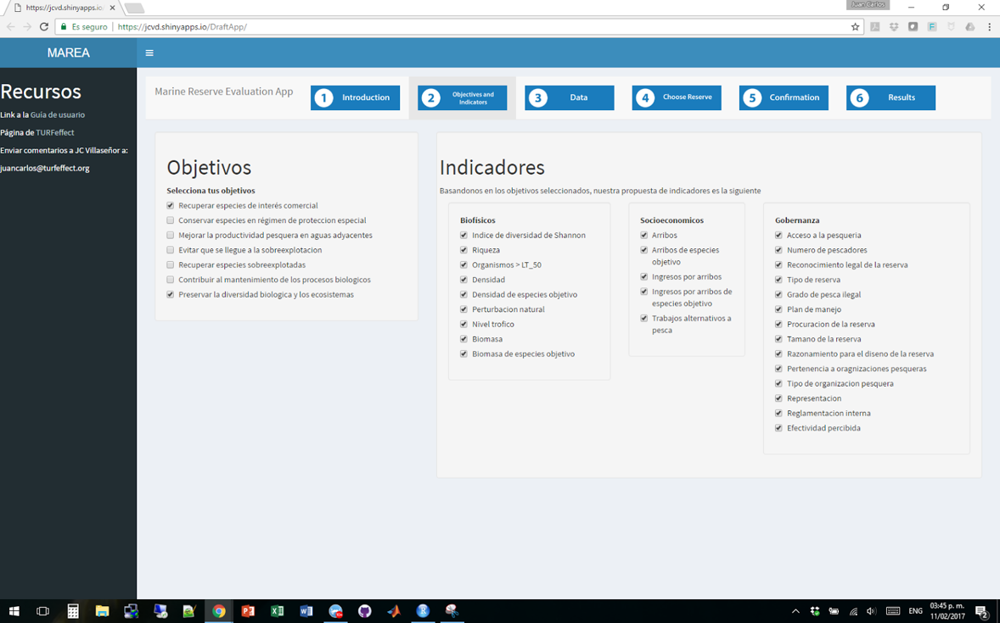
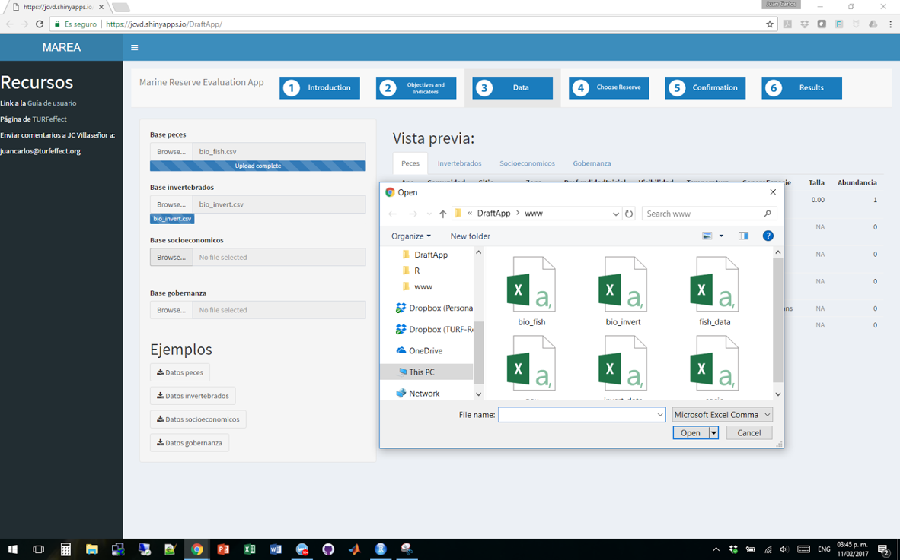
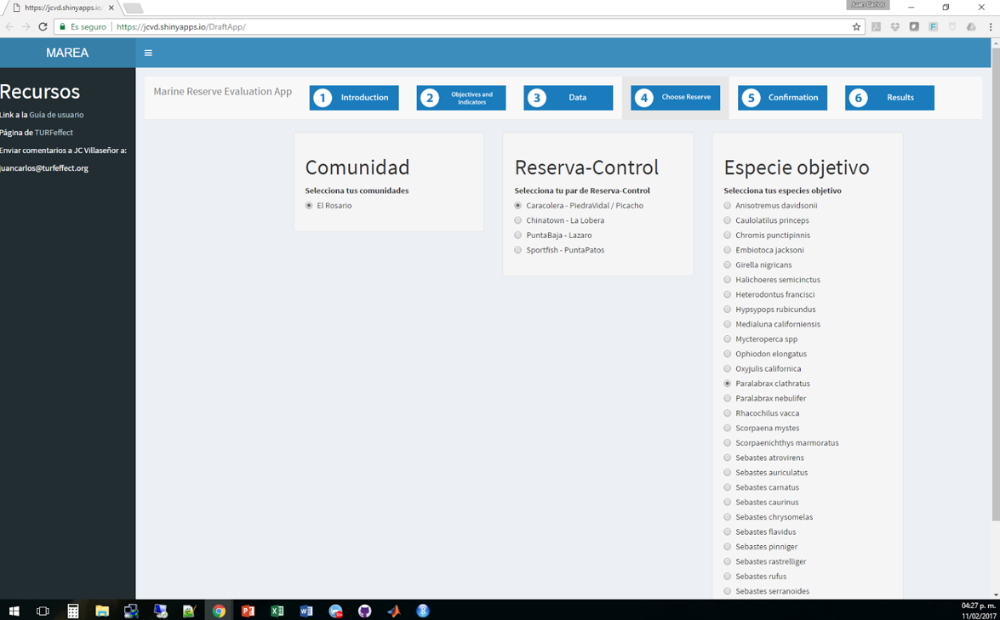
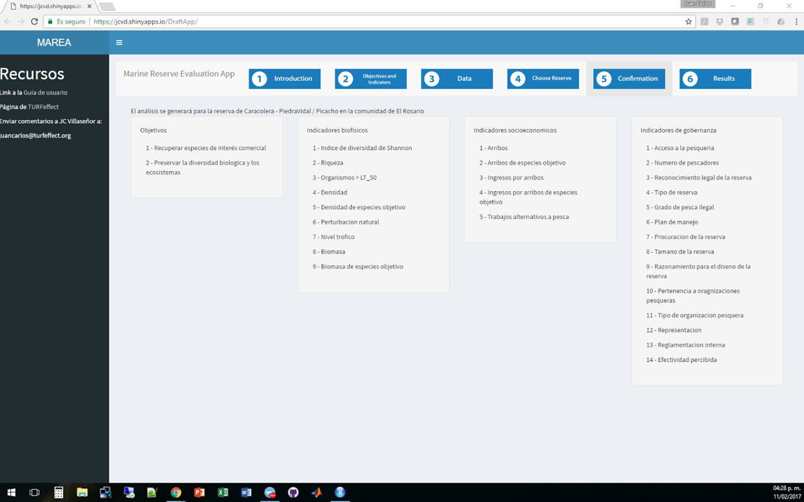
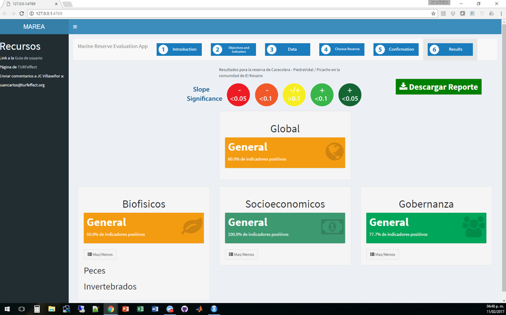
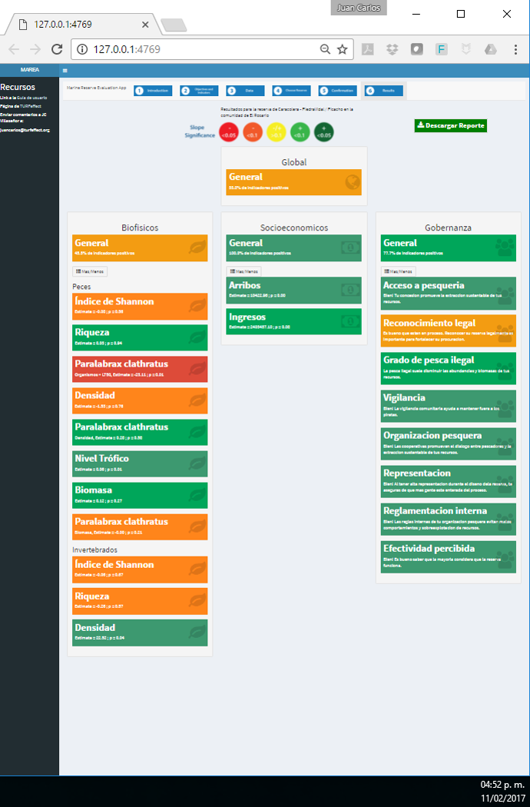
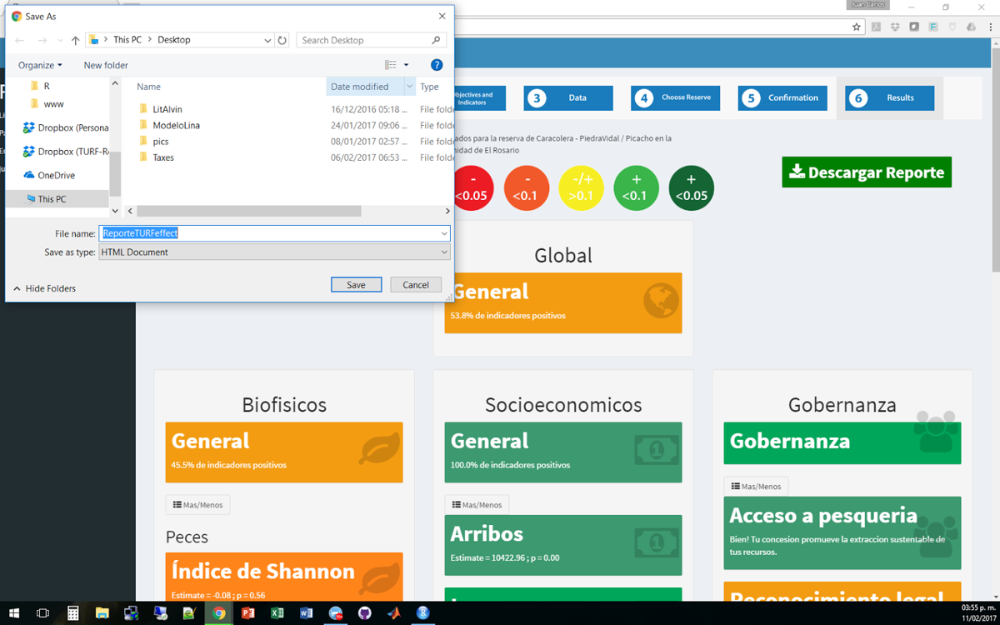

JC Villaseñor-Derbez, C Faro, M Wright, J Martínez, S Fitzgerald, S Fulton, MM Mancha-Cisneros, G McDonald, F Micheli, A Suárez, J Torre, C Costello (2018). A user-friendly tool to evaluate the effectiveness of no-take marine reserves. *PLOS ONE*. [DOI 10.1371/journal.pone.0191821](https://doi.org/10.1371/journal.pone.0191821).

Links:

- Peer-reviewed paper can be found online [here as HTML](http://journals.plos.org/plosone/article?id=10.1371/journal.pone.0191821), [here as pdf](http://journals.plos.org/plosone/article/file?id=10.1371/journal.pone.0191821&type=printable).
- [MAREA](turfeffect.shinyapps.io/marea/)
- [MAREA's guidebook](https://www.researchgate.net/publication/317840581_A_guide_to_evaluate_the_effectiveness_of_no-take_marine_reserves_in_Mexico)

-------

# MAREA

## Overview of MAREA
MAREA stands for MArine Reserve Evaluation App. It is a web-based application developed to automate the analyses defined by the [TURFeffect framework](www.turfeffect.org). It is free and all you need is internet access, the link to the webpage, and the necessary data. The run-time for the analysis automated by MAREA varies depending on the data. The general scorecard will be generated in about 4 seconds, while generating and downloading the report might take up to 20 seconds.

The app is currently hosted at https://jcvd.shinyapps.io/DraftApp/

## Introduction Tab

The first tab will welcome you to MAREA, and will show the overview of the app. On the left side, we have placed a set of links with resources. To hide the sidebar, click on the three horizontal bars to the right of the MAREA text.
MAREA has six tabs, which we will describe soon. You can always switch back and forth across tabs by directly clicking on them. Nevertheless, some tabs will be empty if you have not completed previous tabs.

## Objectives and Indicators Tab

The second tab will show you two panels. The one on the left contains the objectives of your reserve, defined in broad categories. On the right, you can see the indicators, separated by category. Based on the objectives you select on the left, indicators will be automatically matched. However, you can add or remove indicators as you wish.

In this example, the user has selected the first and last indicators: “Recover species of commercial interest” and “Preserve biological diversity and ecosystems.” Together, these objectives require all biophysical, socioeconomic, and governance indicators.

## Data Tab

After selecting your objectives and indicators, you will move on to the third tab where you will upload your data. On the left side, you will see four buttons that say “browse.” Clicking them will create a window that you can use to browse for the folder where you keep your nicely formatted databases. The first slot is intended for fish data, the second for invertebrate data, then socioeconomic and lastly governance data. If you are not sure if your data is in the correct format, you can download sample datasets provided under “Examples.”

To the right, you will see a set of four tabs that say “Fish,” “Invertebrates,” “Socioeconomic,” and “Governance.” Once you upload a dataset, these tabs will show previews of your data. If your data is not in the correct format, an error message will let you know what has failed. You can upload or change a dataset at any time by re-clicking the “browse” button for the dataset you want to replace. You do not need to start all over again.
Loading each dataset will take about five seconds. You can upload a dataset while one is being loaded (see the blue progress bar in Figure 6.4). In this example, the user has already uploaded the fish dataset, invertebrate data is being loaded, and the user is starting to browse for the socioeconomic dataset.

While we encourage you to use all four datasets, MAREA will work as long as you supply at least the fish database. However, the analysis will only be performed on that dataset and some indicators will be ignored.

## Select Reserve Tab
You have now uploaded your data to MAREA! Now it is time for you to select which community and reserve you want to analyze, which can be chosen in the fourth tab. If your indicators require an objective species, this is the place to select it.

This tab works based on the data you have uploaded. Here, the dataset loaded contains information of only one community, “El Rosario.” MAREA identifies all communities and available reserve-control pairs within the uploaded dataset. The list of species is generated, and updated, based on the species available in the selected reserve-control pairs.

In this example, the user selected “El Rosario,” which shows the four reserves located in that community. Then, “La Caracolera - Piedra Vidal / Picacho” have been selected as the sites to evaluate. The list of species to the right is generated based on all species that have been observed in these sites. The user has decided to select Kelp Bass (Paralabrax clathratus).

Here, you will only be able to select one reserve at a time. Nevertheless, your data already lives inside MAREA, and you can go back and forth across tabs any time you want. This means you can change the objectives, indicators, and selected communities or reserves any time you want, without having to repeat the upload process.

## Confirmation Tab

You now get to the confirmation tab, where all the choices made in the previous tabs are summarized for your convenience. After reviewing this information and confirming that this is what you want MAREA to calculate, click on the sixth tab to view your results!

## Results Tab

You can now view your results! It will take about three seconds for things to appear here. Be patient, MAREA is performing all the analysis at once and bringing them to you. Once the results are ready, the dashboard will populate with colored boxes. This dashboard summarizes all your indicators in one place.
Let’s walk through this together. In the center, you will see a small line of text that states the reserve and community for which the analysis was generated. Below that, you will see a legend with five colors, which indicate the state of each of the DiD estimates (described in section 6.1). In section 7, we cover in depth what this colors mean, but the overall message is that green is better than red. 

First you will only see four sections, labeled “Global,” “Biophysical,” “Socioeconomic,” and “Governance.” Inside each section, a box labeled “General” will tell you the percentage of indicators that were positive for each category, or overall for your reserve (“Global” score). If you wish to see more information about each category of indicators, click on the “More/Less” button under each general tab. This will show you one colored box for each of the selected indicators.

If you are interested in a more detailed and technical description of your indicators, you can download a report. You can do this by clicking the green button in the upper right corner called “Descargar Reporte.” This will automatically generate a report including graphs and tables of all the selected indicators. Since a document is being generated, this operation can take up to 20 seconds. A progress bar will be shown in the lower left corner of MAREA. When the document has been generated, a window will open, or a file will begin to download (based on your browser preferences). Section 7 will provide you with more information on how to interpret the results in the scorecard and the report.

